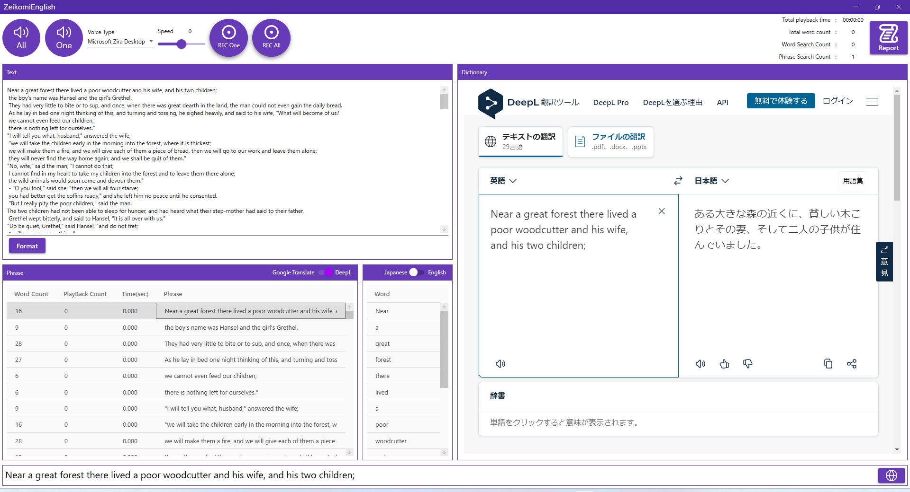
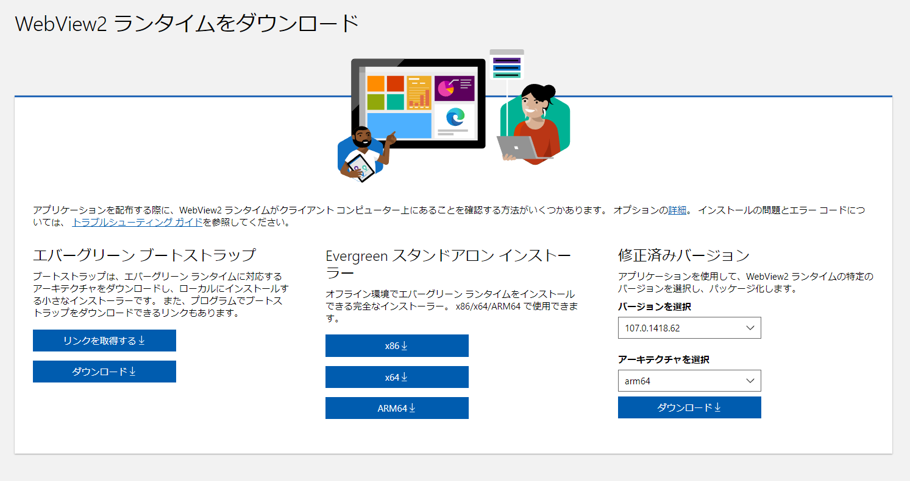

# Zeikomi English

## リポジトリの説明

英語学習者向けアプリケーションです.
合成音声を用いた読み上げとフレーズや単語翻訳を簡易化しました.

## 画面イメージ

## 使い方動画

<iframe width="560" height="315" src="https://www.youtube.com/embed/kTKoU2P7Qec" title="YouTube video player" frameborder="0" allow="accelerometer; autoplay; clipboard-write; encrypted-media; gyroscope; picture-in-picture" allowfullscreen></iframe>

## 環境

- Microsoft Visual Studio Community 2022 (64 ビット)
- .NET 6.0
- Windows 11

## インストール

インストーラは以下の場所においてあります

https://github.com/zeikomi552/ZeikomiEnglish/releases

Windows10以前のものは、WebView2のインストールが必要です
https://developer.microsoft.com/ja-jp/microsoft-edge/webview2/

## 作者について

TOEIC高得点取得に向け勉強中(TOEIC580点)

アプリケーションの不具合や感想、TOEIC勉強法のアドバイスなど何かあればコメントいただけるとうれしいです

HP:https://www.premium-tsubu-hero.net/
Twitter:https://twitter.com/Zeikomi552

